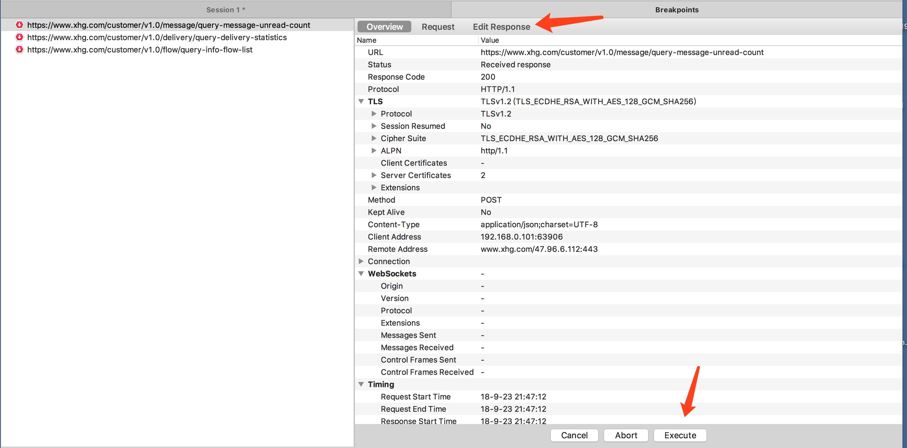

<h1 align="center">😎Charles😎</h1>

### 入门操作

1. [下载Charles](https://www.charlesproxy.com/download/) 
2. 配置Charles证书

3. 配置手机证书    
IOS例子：浏览器访问[https://chls.pro/ssl](https://chls.pro/ssl)，然后安装

    *记得到IOS设置-证书的地方启用该证书*

4. Charles 软件 start recording 开始抓包
5. HTTPS请求的，解决乱码问题的

    **:443*：443端口即网页浏览端口，主要是用于HTTPS服务，是提供加密和通过安全端口传输的另一种HTTP。

6. window系统或者安卓设备则根据 (https://www.charlesproxy.com/documentation/using-charles/ssl-certificates/)进行配置

### 不止抓包看数据
1. 会话记录
    * "File-Save Session"：保存记录到本地，用于API校对（听说后台喜欢改接口？）  
    * *如果停止记录，请求还是会通过Charles，但不会在记录面板上看到*

2. 聚焦（View-Structure-foucs）
    * focus 聚焦主机，当然也可以使用记录面板的filter 过滤你要的ip

3. 节流（*控制宽带网速的时候到了*）
    * 低网速静态内容加载速度
4. 断点😎
    * 向关键url打断点
    
    * 断点上修改request、response的数据，就能在App上修改数据，但是要快！免得算你网络超时
    

5. 自动代理（免得离开代理还上不了网）
    * 这种方法将使您的设备首先尝试使用Charles，但如果Charles未运行，则可以使用直接连接。
    * 设备配置自动代理，例如：https://chls.pro/192.168.0.102.pac、 改了端口的 https://chls.pro/XXXX:XXXX.pac
    * *一些安全性的网站，可能开着代理访问慢或者访问不到或者加密🔐*

6. no Caching(始终看到新版本)
    * 内部实现：No Caching工具通过操纵控制响应缓存的HTTP标头来防止缓存。从请求中删除If-Modified-Since和If-None-Match标头，添加Pragma：no-cache和Cache-control：no-cache。从响应和Expires：0和Cache-Control：no-cache中删除Expires，Last-Modified和ETag标头。
    

7. no cookie
    * 从请求中移除Cookie标头，防止cookie值从客户端应用程序（例如，Web浏览器）发送到远程服务器。从响应中删除Set-Cookie标头，防止请求设置客户端应用程序从远程服务器接收的cookie。
  
8. Map Remote Tool（映射远程站点）
    * Map Remote工具根据配置的映射更改请求位置，以便从新位置透明地提供响应，就好像这是原始请求一样。
    * 通过此映射，您可以从另一个站点提供全部或部分站点。例如，您可以使用 xk72.com/charles/ 到 localhost / charlesdev /的映射为另一个站点的子目录提供服务，或者使用 xk72.com/* 的映射为来自另一个站点的给定后缀的所有文件提供服务。

9. Map local Tool（映射本地站点，岂不是可以mock！）
    * 右键保存接口请求或者响应的数据
    
    * *映射接口的在本地修改json文件并加上.json后缀就行*
    * 如果接口映射成目录，映射到本地的content-type会是text/plain，即使Local path写上 *.json也匹配不了，是charles的不足？ *不，看rewrite！*
    

10.  rewrite (配合Map local Tool ，可mock！)
    * 解决Map local Tool的不足，修改本地文件作为响应时的content-type，这样请求响应的文件也就不需要添加 *.json* 后缀名
    

11.  mirror
    * 生成网站镜像，按照各种请求生成基于路径的本地网站
    * 💯可以减少手动增加响应文件，先生成镜像再改镜像作为新的map local file

12.  repeat or advanced
    * 仅在charles 上做重复和并发，被代理设备不受影响，可做负载均衡
    * 对后台用影响，可快速做访问操作、做假数据
    
### 整点别的

1. 黑名单列表   
    拿来拦截广告！不错不错🦉

