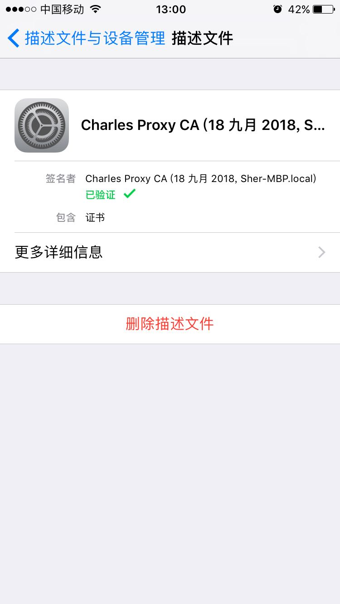

<h1 align="center" >🙄️第一次做h5的悲催日子🙄️</h1>

### 切图工具准备好🔧

> 蓝湖来一个

  

> 来个ps cc （*蓝湖最低配*：2015以上）

1. 通过生产图像资源快速png

2. 通过右键多个涂层

 

### 预览

> chrome devTool
1. 通屏与不通屏的设备
2. 嵌入到app或者手机浏览器时的界面
> 微信开发者工具
1. 模拟微信浏览器上网页的效果
2. 可以调试、检验页面的JS-SDK相关功能与权限，模拟大部分 SDK 的输入和输出
3. 远程查看dom结构，基于Chrome devTool
> 实际设备查看效果

 

### 抓包与mock

> Charles || fiddle 来一个  （Charles为例子🌰）
1. [下载Charles](https://www.charlesproxy.com/download/) 
2. 配置Charles证书

3. 配置手机证书    
IOS例子：浏览器访问 https://chls.pro/ssl ，然后安装

    *记得到IOS设置-证书的地方启用该证书*

4. Charles 软件 start recording 开始抓包
5. HTTPS请求的，解决乱码问题的

    **:443*：443端口即网页浏览端口，主要是用于HTTPS服务，是提供加密和通过安全端口传输的另一种HTTP。

6. window系统或者安卓设备则根据 (https://www.charlesproxy.com/documentation/using-charles/ssl-certificates/)进行配置
7. 查看[更多Charles操作](../charles/memory.md)

 

> postman来一个 

1. 查看[更多postman操作](../postman/memory.md)

