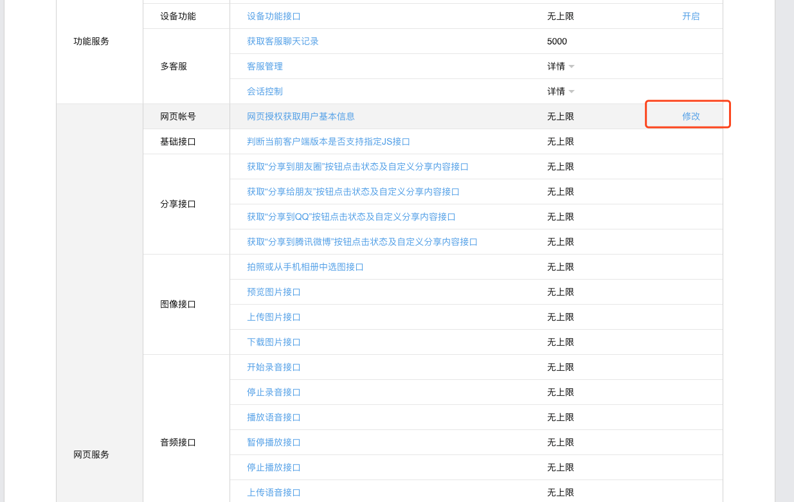

# 测试公众号
为了不依赖前端个人，为了测试方便测试！测试你自己弄去，别打扰我

## 注册个人公众号

https://mp.weixin.qq.com/debug/cgi-bin/sandbox?t=sandbox/login

在这个界面登陆，拿到个人公众号的appId和appsecret；
<br/>


<br/>

## js接口安全配置


<br/>

## 授权回调页面域名




<br/>

> 不要写上https名！

## 个人公众号有了，准备用


## 公众号添加菜单，菜单包含链接

### 1.需要token


到 https://mp.weixin.qq.com/debug/cgi-bin/apiinfo?t=index&type=%E5%9F%BA%E7%A1%80%E6%94%AF%E6%8C%81&form=%E8%8E%B7%E5%8F%96access_token%E6%8E%A5%E5%8F%A3%20/token  这个网页获取token。

<br/>


<br/>

### 2.添加菜单

拿上一步生成的token添加菜单
json：

``` 
{
    "button": [
        {
            "type": "view", 
            "name": "一起测pre2", 
            "key": "V1001_TODAY_MUSIC", 
            "url": "https://pre2.xhg.com/static/alliance/html/allianceBusiness/login.html"
        }
    ]
}
``` 


<br/>


## 开始测试


